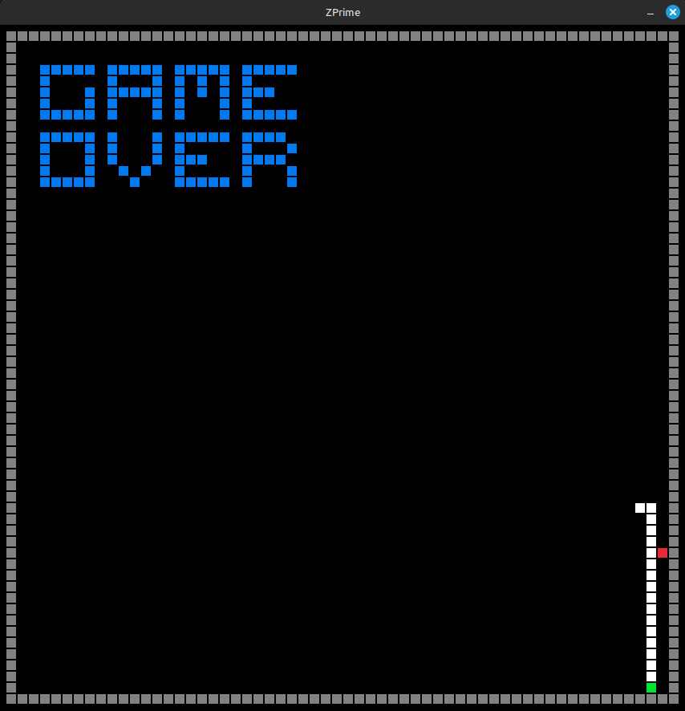
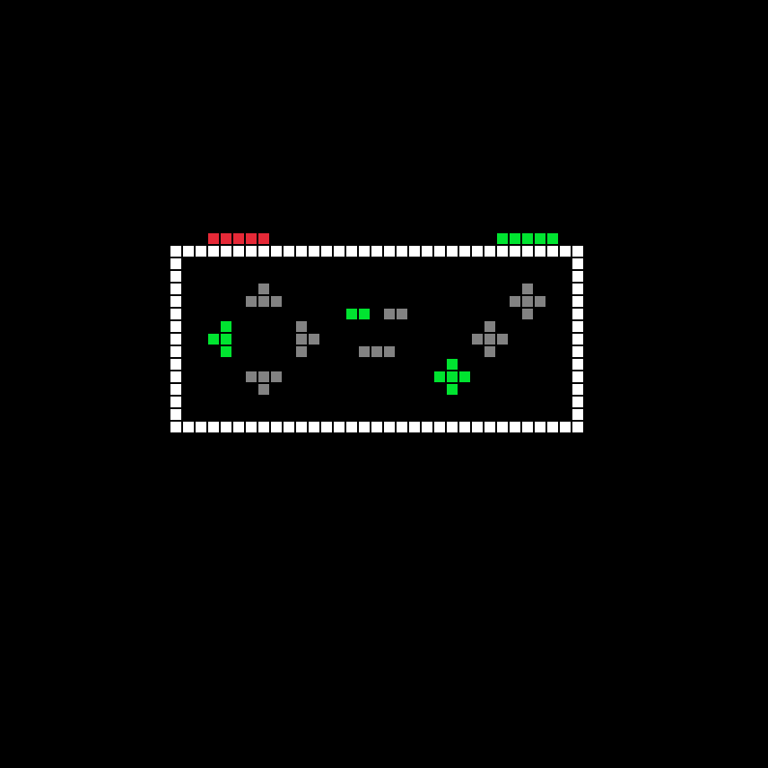

# ZPrime
Projeto ZPrime. Um emulador de um computador retro fictício, inspirado em sistemas clássicos como NES, Atari 2600, Master System... 

## Objetivo
O ZPrime tem como objetivo primário prover uma experiência próxima ao desenvolvimento em um sistema primitivo, sem a necessidade de lidar com conceitos mais complexos, como V/H Blank, memory bank switching e sincronização da PPU. Além disso, ele serve como uma porta de entrada para compreender melhor o funcionamento de linguagens Assembly, sem a necessidade de entender formatos de executáveis, layout de memória ou os pormenores de cada sistema moderno. Basta escrever o seu programa e executá-lo de forma simples e rápida.

## Arquitetura
### Processador
O ZPrime possui um processador de 16 bits, capaz de lidar diretamente com inteiros de 8 e 16 bits, com e sem sinal. Para evitar problemas de sincronização com a renderização, o processador não é limitado a nenhuma frequência específica, e o vídeo é renderizado apenas quando o programador desejar, por meio de syscalls. No entanto, a renderização é limitada a 60 FPS.

O motivo para limitar o FPS a 60 é, primordialmente, evitar complicações comuns em sistemas antigos relacionadas à sincronização da lógica do programa com a renderização e à dependência de V/H Blank.

### Memoria
Toda a memória é implementada em uma arquitetura multi-chip, com RAM, VRAM e ROM, cada uma possuindo um chip de memória dedicado. O motivo para a utilização de uma arquitetura multi-chip, em vez de um único chip (como é mais comum em sistemas similares), é evitar problemas relacionados ao mapeamento de memória e ao bank switching. Dessa forma, em vez de o programador precisar lembrar que a RAM de uso geral começa em 0x9000 e vai até 0xF000, ou de outros intervalos reservados para diferentes componentes, cada aspecto do sistema possui seu próprio chip de memória, cujo espaço de endereçamento vai de 0x0000 a 0xFFFF. A única exceção são os valores de input, que estão localizados nos 16 primeiros endereços da RAM.

### Display
ZPrime possui um display ASCII 60x60, com capacidade para 8 cores em texto e background.

## DEMO
### Snake
Para prova da capacidade do sistema para a criação de jogos imples, uma reprodução do jogo Snake foi feita: `./KPrime run demos/graficos/snake.krom`. A demo possui bugs, porem são bugs no codigo Assembly da demo, e não pela implementação da VM.

### Visualizador de Input
ZPrime possui 12 entradas WASD/Setas, Enter, BackSpace, Space, Q, E, I, O e P. Para demonstrar uma demo para visualizar os inputs em tempo real esta dispoivel com `./KPrime run demos/graficos/input_view.krom`

## BrainPrime
Para demonstrar que um sistema é Turing Complete, ele precisa ser capaz de simular uma Máquina de Turing ou qualquer outro sistema que seja Turing Complete. Para demonstrar a completude de Turing de KPrime, foi criado um compilador de Brainfuck para ZPrime Assembly. Como o Brainfuck já foi provado como Turing Complete, se o ZPrime é capaz de executar programas Brainfuck, então, por definição, o ZPrime também é Turing Complete.

[BrainPrime](https://github.com/MarceloLuisDantas/BrainPrime)